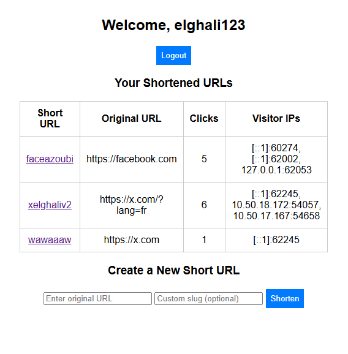

# URL Shortener in Go

A simple, efficient, and secure URL shortener built with **Go**.  
It features **JWT-based authentication**, a **frontend dashboard** for managing shortened URLs, and **Redis** for fast and persistent URL storage.

---

## 🚀 Features

- User registration and login with **JWT authentication**
- Shorten URLs (protected route)
- View and manage your shortened URLs via a **protected dashboard**
- Redirect short codes to original URLs
- **Redis** for fast short-to-long URL mapping
- Simple **static frontend** served directly from the Go application

---

## 📸 Screenshot



---

## 📦 Prerequisites

Before running the project, make sure you have:

- **Go 1.22+** (recommended)
- **Redis** server (local or remote)

---

## 🛠️ Installation & Setup

### 1️⃣ Clone the repository

```bash
git clone https://github.com/xxEBxx/url_shortener_go.git
cd url_shortener_go
```

### 2️⃣ Install dependencies
```bash
go mod tidy
```

### 3️⃣ Configure environment variables
Create a .env file in the project root or export variables manually:
```bash
REDIS_HOST=localhost:6379
REDIS_PASSWORD=your_password_here   # Leave empty if no password
JWT_SECRET=your_strong_secret_key
```

### 4️⃣ Start Redis (if running locally)
```bash
redis-server
```

### 5️⃣ Run the application
```bash
go run main.go
```

The server will start at:
```bash
http://localhost:8080
```

## 🧪 Usage

1. Open your browser and navigate to:  
   <http://localhost:8080>

2. Create a new account using the **Sign Up** page.

3. Log in with your credentials to access the **protected dashboard**.

4. Use the dashboard form to generate shortened URLs.

5. Each shortened URL will follow this format:  
   `http://localhost:8080/<short-code>`

6. Visiting a shortened URL will automatically redirect you to the original long URL.

## 📁 Project Structure
```bash
├── main.go         # Application entry point: server setup, routing, Redis connection
├── auth/           # JWT authentication logic and middleware
├── handlers/       # HTTP handlers (signup, login, shorten, redirect, etc.)
├── utils/          # Shared utility and helper functions
├── frontend/       # Static frontend (HTML, CSS, JavaScript)
├── img.png         # Dashboard screenshot
└── README.md
```

## 🔐 Authentication

Authentication is handled using JSON Web Tokens (JWT).

- A JWT is issued upon successful login.
- Protected routes require a valid token to be included in requests.
- Tokens are typically stored client-side and sent via request headers.

## ⚡ Tech Stack

- **Language**: Go
- **Backend**: net/http
- **Authentication**: JWT
- **Database**: Redis
- **Frontend**: HTML, CSS, JavaScript
